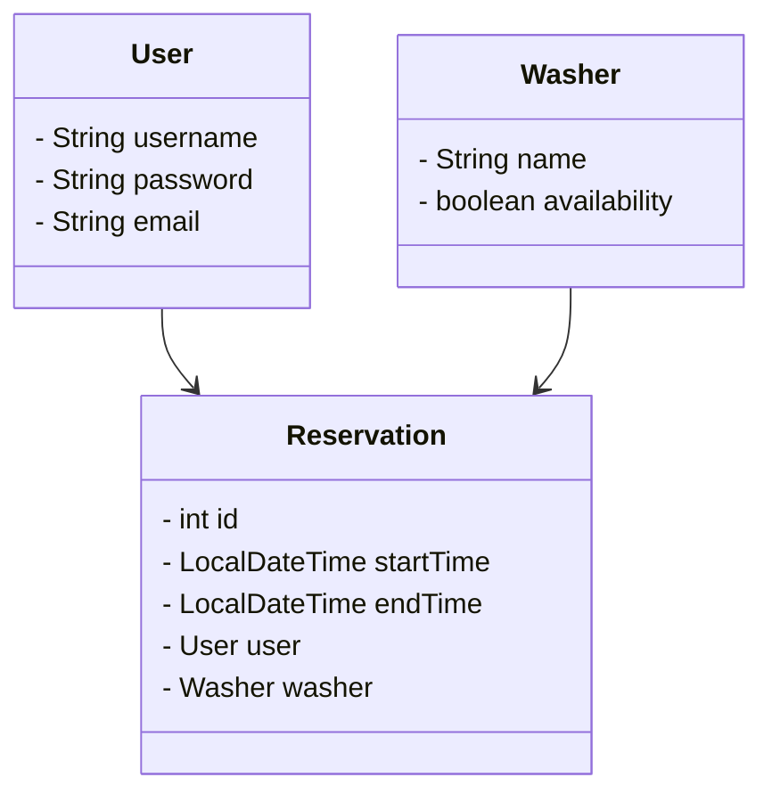
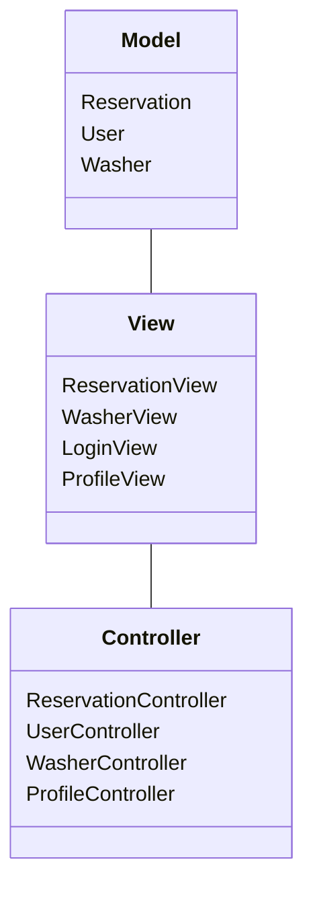
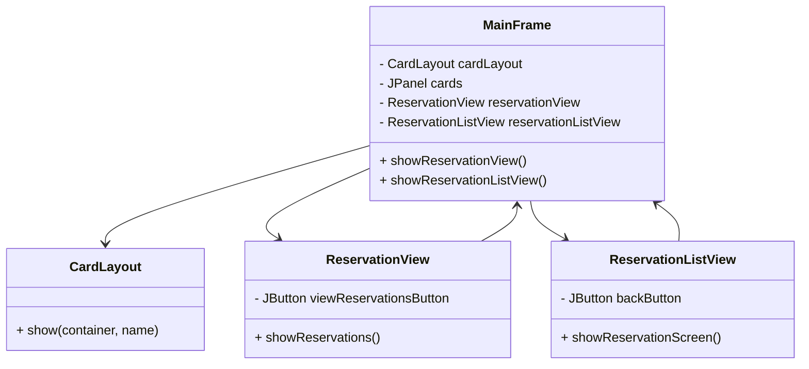
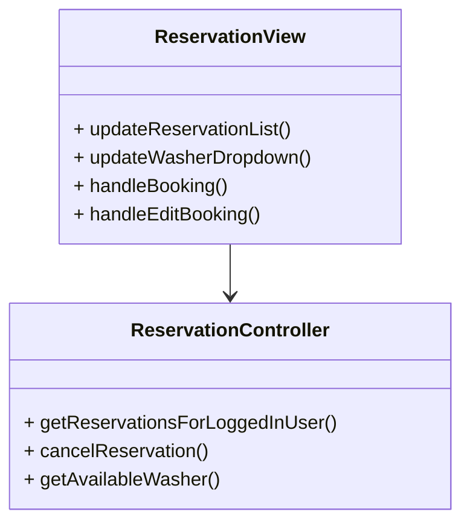
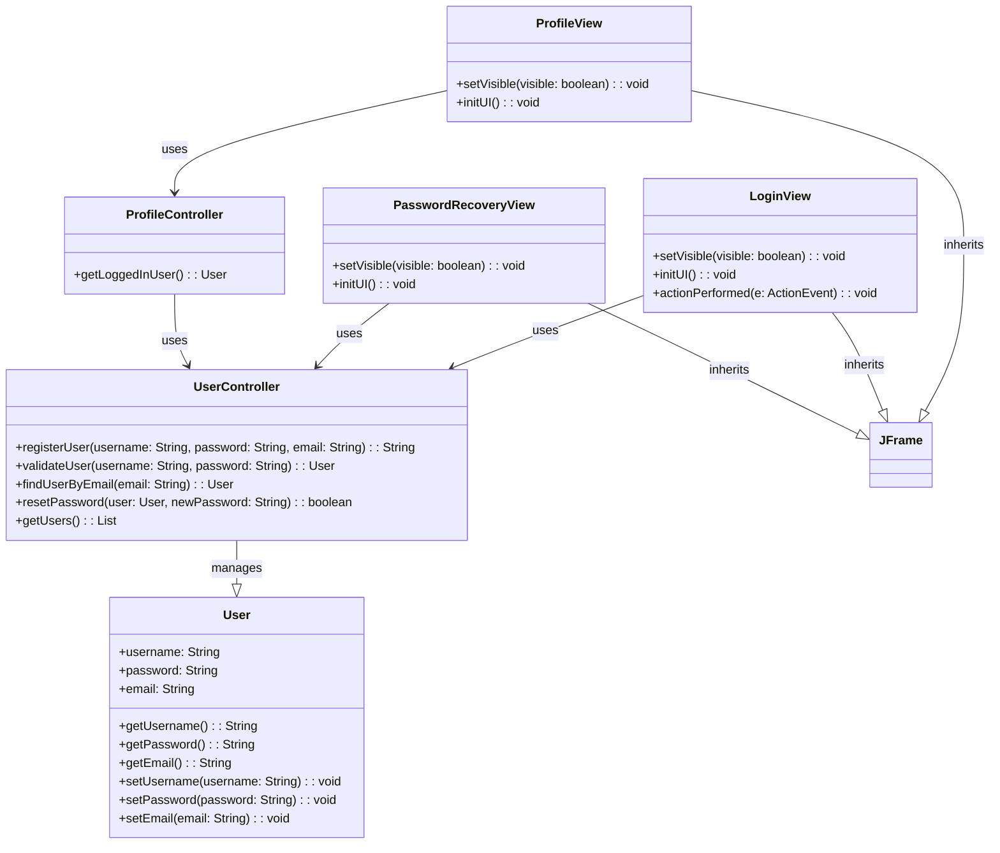
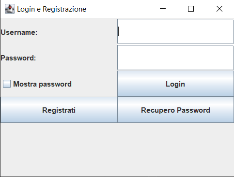
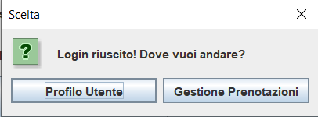
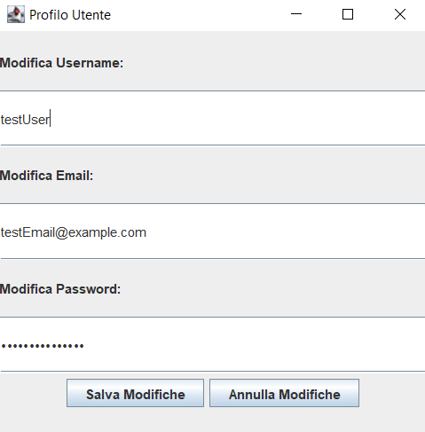
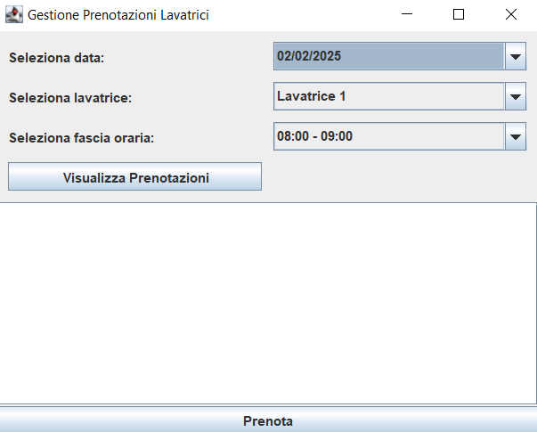
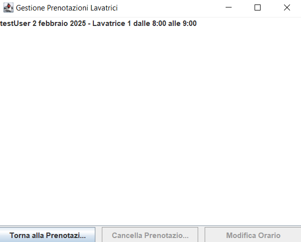

# Relazione per Progetto "LaundryTurn"

# Analisi

## Requisiti
L'obiettivo principale del progetto è sviluppare un software per la gestione dei turni delle lavatrici, consentendo agli utenti di effettuare, modificare e cancellare prenotazioni. Il sistema sarà integrato con un modulo di autenticazione e registrazione per garantire un accesso personalizzato alle funzionalità.

### Requisiti funzionali

- [ ] <b>Effettuare una prenotazione</b>: Un utente autenticato può prenotare una lavatrice scegliendo tra le fasce orarie disponibili. La prenotazione può essere effettuata per un giorno compreso nei sette successivi.

- [ ] <b>Cancallare una prenotazione</b>: Gli utenti hanno la possibilità di eliminare una prenotazione precedentemente effettuata.

- [ ] <b>Modificare l'orario di una prenotazione</b>:  Gli utenti possono modificare l'orario di una prenotazione solo se:
Il nuovo orario non supera un'ora dall'orario attuale.
La nuova fascia oraria scelta è disponibile e non prenotata da altri utenti.

- [ ] <b>Autenticazione e registrazione</b>: Il sistema deve consentire agli utenti di registrarsi e accedere per gestire le proprie prenotazioni.

### Requisiti non funzionali

- [ ] <b>Interfaccia Grafica</b>: L'applicazione utilizzerà Java Swing per la gestione dell'interfaccia utente, garantendo un'esperienza intuitiva e accessibile.

## Analisi e modello del dominio
L’applicazione gestisce la prenotazione delle lavatrici in una lavanderia. Gli utenti possono prenotare lavatrici per fasce orarie predefinite. Il sistema garantisce che una lavatrice non venga prenotata da più utenti nello stesso orario e permette la modifica o la cancellazione di una prenotazione solo entro un certo limite di tempo.

***User (Utente)***
L'utente rappresenta una persona che interagisce con l'applicazione per prenotare una lavatrice. Ogni utente ha una serie di attributi che lo identificano (es. username, password, email) e può avere un insieme di prenotazioni. L'utente può effettuare, modificare o cancellare una prenotazione.

***Washer (Lavatrice)***
Una lavatrice è un oggetto che può essere prenotato. Ha attributi come il nome e la disponibilità. La disponibilità indica se la lavatrice è libera in un determinato intervallo temporale. Le lavatrici sono risorse limitate e devono essere gestite per evitare conflitti tra gli utenti.

***Reservation (Prenotazione)***
Una prenotazione rappresenta l'operazione di un utente che ha riservato una lavatrice per un determinato intervallo di tempo. Una prenotazione contiene informazioni come l'utente che ha effettuato la prenotazione, la lavatrice prenotata, l'orario di inizio e di fine.




Una delle sfide principali è la gestione della disponibilità delle lavatrici. In un determinato intervallo di tempo, una lavatrice deve essere prenotata da un solo utente, e quindi la disponibilità deve essere aggiornata in tempo reale, evitando che due utenti possano prenotare la stessa lavatrice nello stesso orario.

Un altro aspetto critico riguarda la gestione delle modifiche o cancellazioni delle prenotazioni. Il sistema deve permettere agli utenti di modificare o cancellare le prenotazioni solo entro un certo limite di tempo (es. prima di un'ora dalla prenotazione). Questo richiede una gestione precisa dei tempi e delle regole di business.

# Design

## Architettura
L'architettura del sistema di gestione turni lavanderie segue il pattern MVC (Model-View-Controller), garantendo una separazione chiara tra i diversi aspetti dell'applicazione per una gestione efficiente e scalabile.

Il Model rappresenta i dati e la logica di business, comprendendo entità come Utente, Turno e Lavatrice, oltre alla logica di gestione delle prenotazioni e dello stato delle lavatrici.

Il Controller gestisce le interazioni dell'utente e coordina il flusso dell'applicazione. Quando un utente effettua un'azione, come la prenotazione di un turno, il controller elabora la richiesta, aggiorna il modello e notifica la vista con i nuovi dati.

La View si occupa della rappresentazione grafica dell'applicazione. Ogni volta che lo stato del sistema cambia (ad esempio, una nuova prenotazione viene effettuata o una lavatrice diventa disponibile), il modello notifica il controller, che a sua volta aggiorna l’interfaccia utente. Questo approccio consente di modificare o sostituire la GUI senza alterare la logica sottostante dell'applicazione.

Questa architettura garantisce modularità e facilità di manutenzione, permettendo di espandere il sistema in futuro con nuove funzionalità o interfacce grafiche diverse senza compromettere il funzionamento del backend.



## Design dettagliato

### Xiaoran Wu
Il mio compito principale all'interno del gruppo è lo sviluppo della sezione dedicata alla gestione delle prenotazioni. Dopo aver definito la struttura iniziale, ho iniziato a implementare le funzionalità per la creazione, modifica e cancellazione delle prenotazioni. Inoltre, mi sono occupato dell'interfaccia grafica utilizzando Java Swing per garantire un'esperienza utente intuitiva.
Una volta completato lo sviluppo della parte utente da parte della mia collega, mi sono concentrato sull'integrazione tra le due sezioni, assicurandomi che ogni utente potesse visualizzare e gestire le proprie prenotazioni in modo efficace.

**Navigazione tra schermate**



**Problema**  La finestra principale avava dei problemi per passare dalla schermata di prenotazione a quella della lista prenotazioni. Il passaggio tra queste due viste inizialmente non funzionava correttamente.

**Soluzione** Utilizzo del CardLayout, attraverso cardLayout.show(cards, "Reservation") e cardLayout.show(cards, "ReservationList") per garantire un cambio di schermata fluido.
Il pulsante "Visualizza Prenotazioni" è stato collegato alla schermata corretta e la lista delle prenotazioni viene aggiornata prima di mostrarla.

**Aggiornamento della lista delle prenotazioni**



**Problema** Dopo aver effettuato o cancellato una prenotazione, l'interfaccia non aggiornava correttamente la lista delle prenotazioni per l'utente loggato.

**Soluzione** Dopo ogni prenotazione o cancellazione, il metodo updateWasherDropdown() viene richiamato per aggiornare il JComboBox delle lavatrici disponibili.
Questo assicura che l'utente possa selezionare solo lavatrici non occupate.

### Ergisa Xhika
Il mio contributo al progetto è stato focalizzato sulla gestione dell'utente, dalla registrazione alla modifica del profilo.Ho affrontato le sfide legate all'integrazione del flusso di lavoro tra login, registrazione e visualizzazione del profilo. Durante lo sviluppo, ho imparato molto sulla progettazione delle interfacce grafiche e sulla gestione delle azioni utente in un'applicazione Java.

**Gestione Autenticazione e Profilo Utente**

**Problema** Un problema significativo si è presentato nella gestione del flusso di autenticazione, in particolare nel mantenere correttamente lo stato di login dell'utente e nel passare tra la schermata di login e la schermata del profilo utente. La difficoltà principale era quella di gestire il passaggio dei dati utente tra le schermate, garantendo che solo gli utenti autenticati potessero accedere al profilo e alle informazioni sensibili.

**Soluzione** Per risolvere questo problema, ho implementato il controller di login (LoginController.java) che gestisce la validazione delle credenziali e la creazione di una sessione utente una volta effettuato il login con successo. Inoltre, ho progettato la vista di login (LoginView.java) che permette all'utente di inserire username e password, utilizzando la libreria Swing per gestire l'interfaccia grafica. Una volta che l'utente è autenticato, viene indirizzato alla schermata del profilo, gestita dal ProfileView.java, dove può visualizzare e modificare i suoi dati. Per gestire le modifiche, ho creato il controller ProfileController.java, che si occupa di aggiornare le informazioni dell'utente nel sistema e assicurarsi che siano sincronizzate con i dati memorizzati nel file users.txt.

Ho implementato la registrazione con un modulo che permette di inserire un nome utente, una password e un'email. Viene effettuato un controllo per garantire che l'email sia unica e che la password sia sicura.
Autenticazione: Ho creato un sistema di login che verifica le credenziali dell'utente (nome utente e password) e consente l'accesso solo se le credenziali sono corrette.
Gestione Profilo: Dopo il login, l'utente può visualizzare e modificare il proprio profilo. Le modifiche al profilo vengono salvate nel sistema e aggiornate nella UI in tempo reale. Ho implementato l'interfaccia grafica in modo che l'utente possa facilmente interagire con i suoi dati, come la modifica del username, della password o dell'email.


UserController è la classe che gestisce la logica di business (registrazione, validazione, reset della password, etc.) e interagisce con la classe User.

User è una classe che rappresenta un utente, con attributi come username, password, e email. Ha anche metodi getter e setter per ciascun attributo.

LoginView, PasswordRecoveryView, e ProfileView sono classi che rappresentano le viste corrispondenti dell'interfaccia utente, e tutte ereditano da JFrame.

ProfileController è il controller per la gestione del profilo utente, che interagisce con UserController e User.
Ogni classe è mostrata con i metodi principali. 

Le relazioni tra le classi:
LoginView, PasswordRecoveryView, e ProfileView utilizzano il UserController per interagire con i dati dell'utente.
ProfileView e LoginView ereditano dalla classe base JFrame, poiché sono interfacce grafiche.

## Test automatizzato
Nel progetto è stato utilizzato JUnit 5 per automatizzare il processo di verifica delle funzionalità e garantire la qualità del codice. I test automatizzati sono fondamentali per assicurarsi che l'applicazione si comporti correttamente anche dopo modifiche e aggiornamenti al codice.

- **ReservationControllerTest**: Questo test suite si concentra sulla verifica delle principali funzionalità legate alla gestione delle prenotazioni all'interno del sistema.  

- **UserControllerTest** Nel test UserControllerTest, mi sono concentrata su una serie di test unitari per verificare che la classe UserController gestisse correttamente tutte le operazioni legate agli utenti. Questi test sono stati pensati per garantire che la registrazione, la validazione delle credenziali, la ricerca tramite email e il reset della password funzionassero come previsto.
Ogni test verifica che i metodi di UserController restituiscano i risultati attesi, assicurandomi che la logica di gestione degli utenti sia solida e che eventuali errori vengano gestiti correttamente.

## Note di sviluppo

### Xiaoran Wu

#### Utilizzo della libreria Swing
**Dove**: src\main\java\view\ReservationView.java

**Permalink**: https://github.com/RanXXXw/pss22-23--LaundryTurn---Xhika---Wu-/blob/main/src/main/java/view/ReservationView.java

**Snippet**
```java
public class ReservationView extends JFrame {
    private ReservationController manager;
    private JComboBox<String> dateDropdown;
    private JComboBox<String> washerDropdown;
    private JComboBox<String> timeSlotDropdown;
    private JTextArea statusArea;

    private JPanel cards;
    private CardLayout cardLayout;
}
```

**Descrizione**: Utilizzo dei componenti appartenenti alla Java Swing

#### Utilizzo della libreria Stream
**Dove**: src\main\java\controller\ReservationController.java

**Permalink**: https://github.com/RanXXXw/pss22-23--LaundryTurn---Xhika---Wu-/blob/main/src/main/java/controller/ReservationController.java

**Snippet**
```java
    public List<Reservation> getReservationsForLoggedInUser() {
        return reservations.stream()
                .filter(reservation -> reservation.getUser().getUsername().equals(loggedInUser.getUsername()))
                .collect(Collectors.toList());
    }
```
**Descrizione**: Utilizzo degli stream per rendere il codice più conciso e facilitare le operazioni sulle liste

### Ergisa Xhika
#### Utilizzo della gestione degli eventi con ActionListener
**Dove**: src/main/java/view/ProfileView.java

**Permalink**: https://github.com/TuoRepo/pss22-23---LaundryTurn---Xhika---Wu-/blob/main/src/main/java/view/ProfileView.java

**Snippet**
saveButton.addActionListener(new ActionListener() {
    @Override
    public void actionPerformed(ActionEvent e) {
        String newUsername = usernameField.getText();
        String newEmail = emailField.getText();
        String newPassword = new String(passwordField.getPassword());
        if (newUsername.isEmpty() || newEmail.isEmpty() || newPassword.isEmpty()) {
            JOptionPane.showMessageDialog(ProfileView.this, "Tutti i campi devono essere compilati!");
            return;
        }
        loggedInUser.setUsername(newUsername);
        loggedInUser.setEmail(newEmail);
        loggedInUser.setPassword(newPassword);
        userController.updateUser(loggedInUser);
        JOptionPane.showMessageDialog(ProfileView.this, "Dati aggiornati con successo!");
    }
});

**Descrizione**: Gestione degli eventi per il pulsante "Salva Modifiche", che permette di aggiornare i dati dell'utente nel sistema, utilizzando l'ActionListener di Swing. Se i campi sono vuoti, viene mostrato un messaggio di errore.

# Commenti finali

## Autovalutazione e lavori futuri

### Xiaoran Wu
Il progetto finale che ho realizzato è funzionante e durante lo sviluppo non ho incontrato particolari difficoltà; una volta definita la struttura iniziale, il flusso di lavoro è stato molto scorrevole. Ritengo di aver svolto completamente il lavoro, riuscendo a implementare correttamente le funzionalità principali del progetto.

### Ergisa Xhika
Il mio contributo al progetto è stato focalizzato principalmente sulla parte di autenticazione e gestione del profilo. Ho imparato molto, soprattutto in relazione alla progettazione di un flusso di lavoro fluido per l'autenticazione e l'interazione dell'utente con l'applicazione.
In generale, sono soddisfatta del risultato finale, ma c'è sempre spazio per migliorare, mi sono resa conto che alcuni aspetti, come la gestione delle password e la loro sicurezza, possono essere migliorati.
Abbiamo utilizzato un'architettura solida e scalabile e ci siamo concentrati sulla qualità del codice con test automatizzati. Le funzionalità di base sono state implementate correttamente e il sistema è in grado di soddisfare i requisiti iniziali.


# Guida utente

### Login per accedere schermata di prenotazione o profilo


Questa è la schermata principale dell'applicazione, da cui l'utente può effettuare il login o la registrazione.



Dopo aver effettuato l'accesso, l'utente può scegliere tra due opzioni:

- Pagina di prenotazione per riservare una lavatrice.

- Gestione profilo per modificare le proprie informazioni personali.



Nella schermata del profilo, l'utente può visualizzare e modificare le proprie informazioni personali.



Per effettuare una prenotazione, l'utente deve:

- Selezionare la data desiderata.

- Scegliere una lavatrice disponibile.

- Selezionare una fascia oraria.



Dopo aver effettuato una prenotazione, l'utente può visualizzare lo storico delle prenotazioni effettuate e compiere azioni come:

- Cancellare una prenotazione.

- Modificare una prenotazione esistente.
